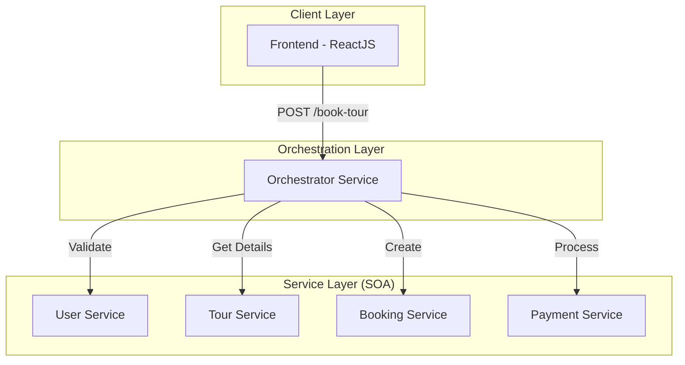

# Project Overview: Travel Booking System (Orchestration-Driven SOA)

## Objective
Implement a Travel Booking System using an **Orchestration-Driven SOA** architecture. This ensures that all business logic and service coordination are centralized in an Orchestrator service, while leaf services remain decoupled and focused on single domains.

## Architecture Diagram (Mermaid)

## System Components & Roles

| Service | Port | Role |
| :--- | :--- | :--- |
| **Frontend** | 3000 | ReactJS UI for User Login, Tour Browsing, and Booking. |
| **Orchestrator** | 8080 | Coordinates the flow: User -> Tour -> Booking -> Payment. |
| **User Service** | 8081 | Manages authentication and user profiles. |
| **Tour Service** | 8082 | Manages tour catalogs and details. |
| **Booking Service** | 8083 | Persists booking records. |
| **Payment Service** | 8084 | Processes payments (Mocked success/fail). |

## Core Principle
- **No direct service-to-service communication.**
- **Frontend only talks to the Orchestrator.**
- **Leaf services only talk to the Orchestrator (via response).**
